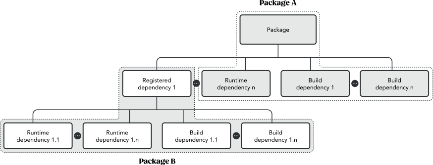

# Disclaimer

The information set out in this white paper is of a preliminary nature.
Consequently, neither the authors nor any of their respective affiliates assume any responsibility that the information set out herein is final or correct and each of the foregoing disclaims,
to the fullest extent permitted by applicable law, any and all liability whether arising in tort, contract or otherwise in respect of this white paper.
Neither this white paper nor anything contained herein shall form the basis of or be relied on in connection with or act as an inducement to enter into any contract or commitment whatsoever.

Nothing in this white paper constitutes an offer to sell or a solicitation to purchase any tokens discussed herein.
In any event, were this white paper to be deemed to be such an offer or solicitation, no such offer or solicitation is intended or conveyed by this white paper in any jurisdiction where it is unlawful to do so,
where such an offer or solicitation would require a license or registration, or where such an offer or solicitation is subject to restrictions.
In particular, any tokens discussed herein have not been, and, as of the date of issuance of this white paper, are not intended to be, registered under the securities or similar laws of any jurisdiction,
whether or not such jurisdiction considers such tokens to be a security or similar instrument and may not be offered or sold in any jurisdiction where to do so would constitute a violation of the relevant laws of such jurisdiction.

# License

The source code[^src] of this paper is available under the Creative Commons Attribution-ShareAlike 4.0 International[^cc] license.

[^src]: See: @sources
[^cc]: See: @cc

# Introduction

The Internet is predominantly composed of open-source projects and has been since its inception.
Over time, many of these projects have become foundational pieces upon which all future innovation is built.
And while fortunes have been made from it, open-source is mainly created and maintained without compensation.

We believe that the entirety of modern human endeavor has been stunted by relying on the smallest percentage of the world's engineers to choose between a salary or keeping the Internet running.
Open-source is a labor of love often hindered by a lack of meaningful economic incentives resulting in genuinely worthwhile projects never reaching their potential while others suffer from security issues due to the lack of incentives to maintain software throughout its lifecycle.
To fully realize our potential, we need a fair remuneration system for the open-source ecosystem that doesn’t fundamentally change how it is built or utilized.

Enterprises often wrap business models around open-source, generating revenue directly from the work of the benevolent developers while also relying on them to fix bugs as issues occur.
A great example is a recent incident involving a critical security vulnerability in Log4j, a package from the Apache Software Foundation that found its way across many commercial software and services employed by enterprises and governments.
In November 2021, a security researcher working for Alibaba Group Holding Ltd. reported vulnerability CVE-2021-44228[^1], which received the highest possible base score from the Apache Software Foundation.
Amit Yoran, Chief Executive of Tenable and founding director of the United States Computer Emergency Readiness Team (US-CERT), described this vulnerability as “the single biggest, most critical vulnerability of the last decade”[^2].
Panic ensued and the few volunteers who maintained this package came publicly under fire for the failure.
After addressing the outrage with a humble plea for fairness, systems got patched.
Enterprises and governments eventually realized that Log4j, a package used by a broad range of critical systems for two decades, was maintained by a few unpaid volunteers, the same unsung heroes who sprang into action despite abuse from the industry[^3] and worked tirelessly to address the vulnerability.

Sadly, Log4j is far from the only example.
core-js is downloaded 30 million times per week as the base of every Node.js application, yet it is also barely funded.
Recently several bitcoin core developers resigned, citing, among other reasons, a *lack of financial compensation* for their decision.

There have been multiple attempts at providing incentive structures, typically involving sponsorship and bounty systems.
Sponsorship makes it possible for consumers of open-source to donate to the projects they favor.
However, picture open-source as a tower of bricks where lower layers are long forgotten, but still maintained by dedicated engineers and relied upon by even more developers.
Only projects at the top of the tower are typically known and receive sponsorship.
This biased selection leads to essential bricks that hold up the tower attracting no donations, while favorites receive more than they need.
Bounties allow consumers of projects to propose payment for developers to build specific features, thus only remunerating projects for doing things not necessarily in their best interest.
And again, only rewarding favorites.

In this paper, we propose tea — a decentralized system for fairly remunerating open-source developers based on their contributions to the entire ecosystem and enacted through the tea incentive algorithm applied across all entries in the tea registry.

$\parskip=0pt plus 1pt$

[^1]: Source: @nist
[^2]: Source: @reuters
[^3]: Source: @twitter

# Components

A software developer building an application needs four things: a browser, a terminal, an editor, and a package manager.
Of these four, the package manager is what controls the tooling and frameworks a developer needs to construct their product.
This layer is where we see the potential to change how open-source is remunerated.

## The Package Manager

The package manager knows what open-source software an application depends on to function, from the top of the tower to its base.
Every component and version essential to the application is known and recorded.
It knows that the top of the tower carefully selects its dependencies and that careful selection continues down.
The package manager is uniquely placed in the developer tool stack to enable automated and precise value distribution based on actual real-world usage.

We propose an immutable decentralized registry designed to distribute value based on an algorithm that determines each entry’s contribution to the system’s utility and health.
Value can enter the graph at apex points—apps and essential libraries—and be distributed to the dependencies of those apex points and their dependencies recursively since the registry knows the entire open-source graph.

Additionally, we believe that material information must be available via the package manager for developers to assess whether they can trust a package and its author.
This information may be based on reputation, community kudos, data retrieved from decentralized identity (DID[^4]) systems, other package managers, or incentive mechanisms that potentially rely on network participants putting economic value at risk.

We predict that tea’s combination of tools, information, and rewards will justly incentivize developers, helping stimulate the growth of open-source software and fostering innovation.

[^4]: See: @w3

## The Decentralized Registry

Every package manager has its own package registry duplicating the same metadata repeatedly.
It’s time there was a single, comprehensive and definitive registry designed and governed by the communities that depend on it.
This decentralized, immutable registry could provide security, stability and prevent
malevolent intent.

The Internet runs on tens of thousands of vital open-source components.
It’s remarkable that thus far, incidents caused by the removal of essential open-source infrastructure have been minimal.
The most famous was the removal of an NPM left-pad[^5] dependency in 2016, which cascaded into continuous integration and continuous deployment systems leaving developers high and dry for days.
This event demonstrated that the Internet itself is based on fragile systems of development.
Other examples involved active or intentional participation from the package maintainers sabotaging their popular packages (See colors.js, faker.js[^6], and node-ipc[^7]),
or bad actors looking to profit by pretending to help maintain packages and corrupting them to steal, for example, Bitcoin private keys (See event-stream[^8]),
or malicious packages with intentional misspelling errors, also known as typosquatting,
in the hope of tricking users into installing them, for example crossenv vs. cross-env NPM packages[^npmjsCrossenv].

Software integrity needs to be guaranteed as the industry progresses towards a future where digital assets are part of the software.
We cannot continue to leave ourselves vulnerable to malicious actors modifying the software.

Most tools that we call package managers cannot guarantee that these packages built into the apps and dApps are the unaltered open-source code published by their original authors.
Microsoft’s GitHub has found that 17% of vulnerabilities in software were planted for malicious purposes[^9], with some remaining undetected for extended periods (See Webmin 1.890[^10]).

A decentralized registry augmented by a reputation system and supported by economic incentives designed to expose bad actors and reward good actors may provide the guarantees developer communities have been looking for.

[^5]: Source: @theregister
[^6]: Source: @fossa
[^7]: Source: @lunasec
[^8]: Source: @github
[^npmjsCrossenv]: Source: @npmjsCrossenv
[^9]: Source: @zdnet
[^10]: Source: @threatpost

## The Storage System

Open-source packages deliver a broad range of functionality, some of which may be restricted or unwanted.
Encryption is an excellent example of that.
A critical use case for encryption is the support of individuals’ privacy across the globe.
Encryption, however, can also be used for nefarious purposes (see Phantom Secure, dismantled by law enforcement agencies in March 2018[^11]) or may be compromised to support law enforcement activities (See Operation Ironside (AFP), Operation Greenlight (Europol),
and Operation Trojan Shield (FBI)[^12] where the FBI operated an “encrypted” communication platform, AN0M, and convinced criminals to use their “encrypted” phones for secure communication).

Encryption’s broad applications have made it a perfect use case for open-source software and a great example that any solution that stores packages must be tamper-proof and censorship-resistant.
tea is a decentralized protocol that does not intend to filter or sanction packages based on their functionality.
While the tea governance may elect to remove proven malicious packages (see the governance section for more information), it is critical for the tea system to connect with multiple storage systems, including decentralized ones that demonstrate that a package is unaltered and correctly replicated.
Package maintainers may choose the storage system best suited for their need to store and distribute their packages securely.

[^11]: Source: @fbi
[^12]: Source: @europol

# Network Participants

tea’s mission is to empower open-source communities and ensure their contributors are supported as they create the tools that build the Internet.
In this white paper, we distinguish participants through their contributions.
Some may contribute code or verify contributed code.
Others may provide economic value to support developers and their reputation.

## Package Maintainers

Package maintainers must make sure their software continues to deliver increasing value as the industry evolves.

tea assumes that package creators maintain their work.
Package maintainers are pillars of open-source communities who need to be empowered and rewarded for their ongoing contributions.
A package maintainer may decide to discontinue their maintenance efforts or realize they cannot operate at a pace that matches the package users' expectations.
Package maintainers receive a non-fungible token (NFT) when they complete a package submission (see the maintainer NFT section for additional details).
This NFT is used to evidence their work and is the key that directs tea rewards.
The holder of a package’s NFT can transfer its ownership to another developer (or group of developers), thus making them maintainers of the package and recipients of any future rewards.
Similarly, a developer may decide to take on the role of package maintainer by forking the existing package and submitting a new one which they will maintain moving forward, thus becoming themselves both package creator and maintainer.

It is essential to provide developer communities with the right tools to determine which packages are being maintained and their past and present maintainers’ reputation and quality of work.
We’ve too often seen open-source work being tampered with and the efforts of many ruined by bad actors.
Although the work of these bad actors is largely discovered and remediated, it is often not until significant damage has been incurred through financial or data loss.
Take for example the EventStream npm package[^13] that was downloaded over 1.5 million times per week and relied upon by over 1,500 packages when a hacker managed to penetrate the open-source project,
gain the trust of its original author and modify EventStream to depend on a malicious package that would exfiltrate bitcoin wallet credentials to a third-party server\.
Although tools may help detect some of these attacks, they cannot always be relied upon, which creates an entire community dependent upon each other’s diligence and willingness to share their findings.

We propose introducing incentives via the tea token described in the tea token section, encouraging open-source communities to report their findings constructively, so package maintainers can address them before they are exploited.

[^13]: Source: @medium

## Package Users

Package users are software developers focused on solving a specific problem.
They often look in the open-source community for the tools they need to experiment quickly and iterate at very little to no cost, directly benefiting from the work of package creators and maintainers.
Traditionally, a subset may have chosen to support package maintainers through donations or other forms of remuneration; however, this has rarely been the case.

Sponsorship can be an effective system to support open-source development; however, remuneration does not typically extend to all dependencies.
This limitation benefits favorites and gets in the way of innovation and software building.
To strive as the foundation of software development, open-source must empower all developers, whether beginners or experts, across all layers in the tower.

tea’s purpose is to maintain the core values of open-source software while providing a decentralized system to remunerate package maintainers for their work.
To deliver on this mission, tea intends to develop — and incentivize others to develop — mechanisms for package users to support package maintainers through unique use cases of the tea token, as described in the tea token and future work and potential community effort sections.

## Package Supporters and Sponsors

In Web 2.0 and web3, package supporters have often been called “sponsors.” They are organizations or package users who use open-source software to build their commercial products, philanthropists looking to support the ecosystem, or entrepreneurs looking to fund teams to develop components of a larger system.

tea proposes to extend the communities of package supporters to the entire tea community, whether organizations, developers, users, or tech enthusiasts.
tea’s goal is to implement decentralized incentive mechanisms through unique use cases of the tea token for any member of the tea community to contribute to the perpetual sustainability and continuous growth of open-source.
Package supporters and sponsors are free to decide which packages or package maintainers they want to support based on their work, beliefs, or any criteria and metric that would influence their decision.
Additionally, the support provided by package supporters and sponsors will flow to each package’s dependencies, thus implicitly trusting the package maintainer to make good choices about their stack and using this information to contribute to their reputation.

Provided that the package maintainer offers such service, a package supporter and sponsor may receive a premium support level NFT in return, thus benefiting from accelerated SLAs or more flexible licensing.
Additionally, package supporters and sponsors may decide to support packages or package maintainers and automatically redirect all or a percentage of their rewards to incentivize teams to build new open-source software.
In other words, packages don’t need to exist for tea to start pouring in.
Nascent projects can be supported just as well as more mature ones, further incentivizing a constantly evolving open-source landscape.

## tea Tasters

As new packages or new versions of existing packages are released, the validity of the work needs to be provably demonstrated.
This information is critical for package users to decide whether or not to trust both the package and its maintainers.
With the tea protocol, this function is provided by the tea tasters.

tea tasters, typically, are experienced software developers willing to dedicate some of their time to check the claims associated with a package (functionality, security, semantic versioning[^14], license accuracy, etc.)
and stake both their reputation and economic value to demonstrate the outcome of their research and analysis and support their reviews.
tea tasters receive rewards for their diligence and efforts.
At tea, we call  “steeping your tea” the action of locking tea tokens to support your reviews and receive rewards (or penalties) based on the consensus on the validity of your reviews.

Like package supporters, tea tasters can influence a package and package maintainer’s reputation; however, their impact is more significant given their role in validating a package’s security, functionality, and quality.
tea tasters will also need to build their reputation to support their claims.
The quality of their work and the economic value they put at risk as they steep their reviews combined with other external data sources will build each tea taster’s reputation, bringing more value to their work.
See the package reputation section for more details on the mechanisms used to influence a package and package maintainer’s reputation.

[^14]: See: @semver

# Protocol Overview

The design of a protocol to reward open-source contributions is mired with challenges.
Open-source software is by definition open to all and can, as a result, be subjected to misattribution, appropriation, or malicious tampering.
However, the open-source community has consistently demonstrated its willingness to highlight good actors and expose bad actors.
Historically, the energy spent reviewing and commenting on other developers’ contributions has been strictly voluntary, despite how time-consuming and crucial reporting and defending findings may be.

We intend to create a trustless distribution platform for applications secured by reputation and financial incentives, as we believe adequate rewards for open-source contributions cannot succeed without both a reputation system and the ability for members of the community to communicate their findings and support (or dissent) for a package or the work of a developer.

We must provide developers with tools to access and contribute to this reputation system.
Tools that include simple visual and programmable access to the version and reputation of all dependencies within their packages.
A clear understanding of which community members support each package and how many tea tokens they are steeping will contribute to the reputation of each package, just as how much a package maintainer is steeping their work communicates how much they stand behind their work.
These combined data points will help inform a reputation system for all community members and facilitate choice.
As the EventStream package hack was not conducted through the package itself, but via one of its dependencies, visibility across all layers of dependencies will be vital to building this trustless system.
However, considerations such as computation and transaction (“gas”) costs will need to take priority as the system is designed and built.

Our goal is to reward both Web 2.0 and web3 developers.
The intricacies and specifics of each stack make it so that tracking installations and uninstallations of packages could easily fall victim to one or more bad actors.
That includes “buying” installations to artificially inflate numbers.
An even worse scenario would be introducing fundamental changes to the nature of open-source software by creating unnecessary friction with license keys or other deployment tracking mechanisms.
To provide the broadest coverage, we believe that rewards mustn’t rely on a simplistic notion of tracking installations or uninstallations, but rather on incentive mechanisms that encourage the submission of quality packages and the reporting of nefarious or high-risk packages.
Lastly, many packages rely on common dependencies.
For example, Lodash has 151,209 dependents[^15] while chalk has 78,854 dependents[^16] or Log4js has 3,343 dependents[^17].
As more packages are created using the same dependencies, how do we ensure that incentives are distributed fairly and equitably?
How do we ensure that the most utilized dependencies are rewarded without starving new or emerging packages and developers?
How do we ensure that the incentive system does not end-up steering developers away from niche languages to centralize them where incentives are better?
But also, as developers, how do we identify packages with the most dependents to build alternatives - leaner, more efficient, better-coded versions of these packages?
At tea, we believe that the lack of incentive has impeded the evolution of open-source software.
Supported by the right economic incentives and rewards, more developers will be in a position to build, improve and augment open–source software for the betterment of the world.
Only then will the tea token be able to represent the total value of open-source software.

[^15]: Source: @npmjsLodash
[^16]: Source: @npmjsChalk
[^17]: Source: @npmjsLogFourjs

## Package Submission

The submission of a package release requires multiple transactions to occur atomically.
Specifically, the package maintainer must:

* Register the package (and its semantic version) with the decentralized registry.
* Upload the package into the decentralized storage system for resilience, censorship resistance, and ease of distribution.
* Contribute to the package’s reputation and trustworthiness by *steeping* tea tokens.

Failure of any one of the three operations will result in the protocol reverting to its previous state, thus eliminating any evidence of the submission.

When a package is successfully submitted, the package maintainer will receive a maintainer NFT to evidence their work and contribution to open-source.
The package maintainer may transfer the steeping rewards associated with the maintainer NFT to a third party.
However, the reputation associated with the creation and maintenance of the asset will remain with the package maintainer, so their reputation can be affected over time.
As the reputation of any member of the tea community reaches key milestones, they may be granted access to elevated parts of the protocol or receive accelerated rewards, as decided by the tea governance.
For more details on the maintainer NFT, see the maintainer NFT section.

### Dependencies Analysis

Package dependencies can run deep, as each package often has both dependents and dependencies.
To provide a simple methodology that rewards all developers who have contributed to open-source software while keeping the creation of the dependencies tree quick and computationally efficient, we propose to verify only first-level dependencies upon submission of a package.

This design is driven by the hypothesis that each dependency is itself a package that was independently submitted to the tea tree.
In doing so, each of its dependencies can be mapped, and if its dependencies have dependencies themselves, those will be mapped at the time the dependency package is submitted.

{#fig:dep-analysis}

In @fig:dep-analysis, the submission of package A triggers an analysis of runtime dependencies 1 through n and build dependencies 1 through n, while runtime dependencies 1.1 through 1.n and build dependencies 1.1 through 1.n were analyzed when package B was submitted.
We will apply the same methodology for incentive distribution as the steeped tokens are distributed across all dependencies, thus recursively steeping the packages listed as dependencies (see @fig:steeping-rewards).

{#fig:steeping-rewards}

Versioning and conflicting dependencies are significant challenges, and troubleshooting them can turn into massive time drains.
To address this, we propose each package be subject to a comprehensive dependency scan upon submission so we can ensure that the package complies with the following rules for semantic version ranges.

* Packages may only constrain their dependencies to a major version, though the start of the range can be any valid semantic version (e.g., >=5.2.1 <6).
* If a dependency is upgraded to a more recent major version, tea may require that the package’s major version be increased.
* Similarly, if a dependency is upgraded to a more recent minor version, tea may require that the package’s minor version be increased.
* If a new dependency is added, tea may require that the package’s minor version be increased.

Considering the unnecessary effort imposed upon any package user when the above rules are transgressed, we propose that a portion of the tea token steeped by the package maintainer be slashed to reflect their lack of due diligence.
If a developer forces everyone to juggle their cups, someone will spill some tea.
Since the dependency scan is expected to occur at submission, we should note that no steeping from package supporters and sponsors or tea tasters will have happened.

## Package & Package Maintainer Reputation

Package maintainers must contribute to their package’s reputation and trustworthiness by steeping tea tokens.
However, a reputation system that relies solely on the author’s economic contribution does not provide sufficient user protection and can be subject to Sybil attacks, where a single individual creates multiple representations of themselves to leave a large volume of positive reviews on their work,
tricking users into believing their work was reviewed and approved by many.

Several methodologies are available to prevent Sybil attacks, some of which are described by Nitish Balachandran and Sugata Sanyal in “A Review of Techniques to Mitigate Sybil Attacks”[^18].
As tea is a decentralized protocol, using a trust certification system that relies on a centralized certificate issuance authority would be contrary to its core.
We propose to focus on decentralized approaches to Sybil attack mitigation and, more specifically, on methodologies that rely on a large group of network participants incentivized to assess and publicly represent the reputation of each package and its maintainer.

Similar to the production of blocks on a proof-of-stake blockchain, where non-producing nodes can validate the work of others and, when necessary, highlight a violation of the rules of the network, which leads to a penalization of the bad actor through slashing (destruction of a portion of their stake),
we propose a system whereby third-parties (aka tea tasters) would be able to review packages produced by package maintainers and be economically incentivized to behave in the best interest of the open-source software community and its users as well as recognize good behavior and penalize bad behavior.
This system must be both Sybil resistant and prevent large token holders from materially influencing the protocol or the reputation of specific packages.
We believe this approach to be more aligned with open-source, providing a more fertile substrate to foster adoption and trust, and ultimately facilitate the growth of tea.

[^18]: Source: @arxiv

## Package Review by Third Parties

The review of packages by third parties is an essential component of reputation building, however, third-party review has its own set of unique threats including the aforementioned Sybil attacks.

Blockchain technology, and more explicitly staking, offers a unique opportunity for tea to tackle this challenge.
Although wallet addresses may be available in infinite quantities, this is not the case with tea tokens, whose initial supply is expected to be 10 billion.
Additionally, each action performed by developers, such as submitting packages, verifying packages, or steeping them, will contribute to their reputation, thus creating a unique profile each developer can use to both contribute to the tea community and participate in tea’s governance.

By requiring third-party reviewers to steep tea tokens and incur the risk of losing a portion of their steeped tokens should they turn out to behave against the interest of the network or be a bad actor, third parties can provide additional credence to a package and receive a reward, in the form of tea tokens.

We also propose extending the reputation system to the third parties who perform the independent verification of packages - the tea tasters.
The completion of a positive review will require two operations to occur atomically:

* The submission of the code review, signed by the tea taster and publicly accessible to all members of the community, along with
* The act of steeping “for” the package (vs. “against” the package), to substantiate their review.

The completion of a negative review that includes one or more critical vulnerabilities will require the tea tasters first to contact the package maintainer using a messaging protocol to notify them of the vulnerability and allow them to address the issue in a timely fashion.
Upon expiry of the governance-defined period allocated to the package maintainer to address their vulnerability or as the corrected package becomes available, the same messaging protocol will be used to notify all users and testers of this package (including dependents) that a vulnerability has been identified,
and hopefully addressed, so they know to update their application or dependencies.
To disincentivize wasting developers’ time, communication between the tea tasters and package maintainers will require the tea tasters to steep tea tokens.

Upon completing both operations, the tea tasters will receive an NFT as evidence of their work on the specific package and package version.
The accumulation of NFTs combined with the steeping ratio of each of the packages reviewed and information extracted from external systems will inform a tea taster’s reputation.
As their reputation reaches key milestones, tea tasters may earn access to elevated parts of the protocol or accelerated rewards, as decided by the tea governance.

## Outdated or Corrupt Packages

tea’s mission is to reward contributors and participants in the open-source communities; however, rewards must be commensurate with the efforts deployed by package maintainers and tea tasters.
Under-maintained, outdated, or corrupted packages are clear indications of package maintainers not living up to the community’s expectations or not delivering on the trust and support impressed upon them through the steeping of packages.
Another manifestation of outdated packages may be the continued use of a legacy language or legacy version of multi-version languages.
Packages remaining outdated or corrupt for too long indicate that tea tasters need to review package maintainers’ work regularly and consistently.

tea tasters are critical members of the open-source communities in that their reviews and associated claims can steer package users towards or away from packages.
To ensure that reviews can be trusted on an ongoing basis, we propose a mechanism whereby outdated or corrupted packages may see a portion of their steeped tokens sent to the tea tasters who were first to recognize the lack of maintenance of any package.

Any negative review which outlines a flaw such as a zero-day vulnerability or the use of an outdated dependency and remains open past a grace period defined by governance should be considered a failure on the part of the package maintainer.
They have not completed the task they were entrusted with and rewarded for.
The same can be said for package supporters and sponsors who staked their reputation on the work of delinquent package maintainers and received rewards for it, but failed to identify the lack of maintenance or elected to continue to support the package regardless.

As packages gain in popularity and usage, with more applications and potentially mission-critical systems depending on them, we must incentivize developers to discreetly report flaws to the package maintainer and package maintainers to address such flaws before they can be exploited.
Consequently, we propose that any outdated or corrupted package which is subject to one or more evidenced negative reviews and remains in such state past the governance-defined grace period see a portion of its steeped tokens be slashed regardless of their origin (package maintainer, package supporters, and sponsors or prior tea tasters),
while another portion is sent to the tea tasters who submitted the negative reviews.
Distribution to all tea tasters could be based on the age of their review and the number of tea tokens they steeped for their review.

## Maintainer NFT

Upon successful submission of a package, the package maintainer will receive an NFT to evidence their work and contribution.
The holder of this NFT will automatically receive all rewards associated with the package.
Package maintainers may transfer maintenance ownership over a package to another package maintainer by simply transferring the package’s NFT.
Successful transfer of the NFT will lead to the new owner automatically receiving future package rewards.

An important part of reputation building relies on the frequency and quantity of quality package submissions.
The NFT delivered to package maintainers as evidence of their work may be used by the reputation system to update a package maintainer’s reputation and give them access to elevated parts of the protocol, as decided by the tea governance.
However, to prevent attack vectors, such as community members buying their reputation, the transfer of the maintainer NFT will not result in a transfer of reputation.
Reputation must remain directly associated with a specific developer’s work and must not be transferable.

# tea Token

## Securing the Network

While many blockchains may appear as effective and secure infrastructure solutions to support tea’s objectives, we believe that careful consideration must be given to the technology stack upon which the tea system is built.

Scalability, cost-effectiveness, ESG, and third-party extensibility are important design considerations that a tea-sovereign proof-of-stake system could better serve.
In proof-of-stake, node operators and network participants stake economic value in the form of the chain’s native token to increase the system’s security.
Node operators and network participants receive rewards for the successful production of blocks that comply with the rules of the network and include accurate transaction information.
Inactivity (aka node down) or malicious/incorrect activity are penalized by destroying a fraction of the staked tokens through slashing.

A proof-of-stake system powered by the tea token will allow tea token holders to contribute to the system’s security by *staking* tea and support open-source developers by *steeping* tea.
We're fully aware economic factors may prevent some developers from staking or steeping tea; as such, staking and steeping will be available for as little as a leaf, the smallest denomination of tea representing one one-hundred-millionth ($10^{-8}$) of a tea.

Both applications of the tea token serve vital functions in the support and growth of the open-source ecosystem.
Staking tea will ensure that the tea system continues to operate securely, so all network participants can submit and access packages to review them, integrate them into their application, etc.
In contrast, the steeping of tea will support tea’s goal of providing tools for all network participants to support and use packages that meet quality and dependability requirements, as formulated by the tea community through their support and dissent of each package.
Care will be taken when defining and implementing staking and steeping parameters so one does not become parasitic on the other.

## Incentives and Penalties

As discussed earlier, there can be strong incentives for bad actors to compromise open-source software.
The majority of the Internet’s critical infrastructure is running on open-source, and the race to find exploits and other vulnerabilities is on.
At tea, we believe that package maintainers are not the ones that should be blamed (although they often are).

tea protocol incentives fix this through a fair and equitable incentive distribution.
A package like Lodash with over 151k dependents is a pillar of open-source development, and its maintainer deserves to be rewarded proportionally.
However, a reward system built solely on the number of dependents would prevent innovators from disrupting these monopolies unless they are sufficiently funded by third parties or have already accumulated enough resources to self-fund.
This approach would likely lead to a shrinking number of contributors, resulting in the polar opposite of what tea is about.

tea’s goal is to represent the value of open-source software and, in doing so, foster its growth by empowering its participants with the resources they need to pursue their passion unencumbered.
The tea incentive distribution system needs to carefully consider the steeping ratio of each package and adjust each package’s incentive accordingly.
To reduce the risk of a small number of packages used as dependencies across many applications collecting the majority of steeping rewards, we will leverage the research produced by the web3 Foundation[^19] for the Polkadot proof-of-stake-based rewards mechanism.
We may further adjust the implementation and its variables based on the results of practical experiments.

As a package steep approaches a governance-defined optimum steeping ratio, its steeping rewards ratio will decrease progressively.
When a package exceeds its optimum steeping ratio, the steeping rewards ratio will decrease sharply to de-incentivize package supporters and tea tasters from further steeping highly steeped packages.
This design could allow lesser steeped packages to become more attractive to both package supporters and tea tasters.
It may also incentivize experienced developers to build alternatives to highly-steeped packages, creating an opportunity for the tea community to balance supporting existing software and promoting innovation.
The steeping ratio will be calculated using the circulating supply in its initial design.
The tea community may alter this design to improve the system’s scalability further.
Let $\chi$ be the steeping ratio across all packages.
It represents the total number of tea tokens steeped by package maintainers, package users, package supporters and sponsors, and tea tasters divided by the total tea token supply.
Given how many open-source packages are available today and their expected growth, $\chi$ will always be a very small value between $0$ and $1$.

Let $\psi$ be the staking ratio.
It represents the total number of tea tokens staked by any network participant to secure the network.

Let $\chi_{ideal}$ be the steeping ratio we would like each package to attain for a fair distribution of rewards across all packages and their dependencies.
The value of $\chi_{ideal}$ must be updated as new packages are added to the decentralized registry, and dependencies are created.
To determine the best value for $\chi_{ideal}$, we will use a popularity bell curve updated at the start of each reward cycle.

Let $\tau = \tau(\chi)$ be the annual steeping interest rate distributed to all tea community members who steep tea tokens to support open-source developers.
In other words, $\tau(\chi)$ corresponds to the steeping reward received over a year by a community member that steeps tea tokens for the entire year.

Let $\gamma = \gamma(\psi)$ be the annual staking interest rate distributed to all node operators and network participants who stake tea tokens to secure the network.
In other words, $\gamma(\psi)$ corresponds to the staking reward received over a year by a community member that stakes tea tokens for the entire year.

Let $\delta$ be the annual inflation directed at the network treasury.
$\delta$ may vary as external factors affect the token supply.

We consider the annual steeping reward rate as a function of $\chi$ and the annual staking reward rate as a function of $\psi$.

* $\tau(\chi)$ corresponds to the incentive for people to steep a package.
As $\chi$ increases, fewer rewards $\tau(\chi)$ are needed.
* $\gamma(\psi)$ corresponds to the incentive for people to stake the network.
As $\psi$ increases, fewer rewards $\gamma(\psi)$ are needed to secure the network.

The annual inflation $I$ will be equivalent to $(\tau + \gamma + \delta)$ and calculated as follows:

$$
I = \frac{\textrm{token supply at the end of the year} - \textrm{token supply at the beginning of the year}}{\textrm{token supply at the beginning of the year}} = (\tau + \gamma + \delta)
$$

The contribution to inflation of $\tau_{\textsc{all}}$ (incentive distributed to all package steepers) and $\gamma_{\textsc{all}}$ (incentive distributed across all contributors to the network security) should be weighed to ensure that the system incentivizes the optimal steeping/staking ratio.

As we focus on the incentives distributed across all package steepers, we determine that
$\tau_{\textsc{all}}$
is a function of the steeping ratio $\chi$ and therefore
$\tau_{\textsc{all}}(\chi) = \chi \cdot \tau(\chi)$.
From our previous analysis, we can see that
$\tau_{\textsc{all}}(\chi_{ideal}) = \chi_{ideal} \cdot \tau_{ideal}$.
Since the goal is to reach a state where
$\chi = \chi_{ideal}$
, rewards
$\tau_{ideal}(\chi)$
should be maximal at that value.

Let $\tau_{ideal} = \tau(\chi_{ideal})$
be the reward rate delivered by the network at the ideal scenario where
$\chi = \chi_{ideal}$.

Let $\tau_{0}$ be the limit of  $\tau_{\textsc{all}}(\chi)$ as $\chi$ goes to zero when no members of the tea community steep any packages.
The value of $\tau_{0}$ should be close to zero but not zero to incentivize early adopters.
As suggested by the web3 Foundation’s research, we propose that:

* the inflation function grows linearly between $\chi = 0$ and $\chi = \chi_{ideal}$, and
* it decay exponentially between $\chi = \chi_{ideal}$ and $\chi = 1$.

We chose a similar exponential decrease for $\tau_{\textsc{all}}(\chi)$ because it implies an exponential decrease of $\tau(\chi)$, and we want rewards to fall sharply beyond $\chi_{ideal}$ to prevent a single package from receiving all the rewards.

The decay is defined so that the inflation rate decreases by at most 50% when  $\chi$ shifts $d$ units to the right of $\chi_{ideal}$ – i.e.
$\tau_{\textsc{all}}(\chi_{ideal} + d) \geq \tau_{\textsc{all}} \cdot 0.5$.

We propose the following interest rate and inflation rate functions, which depend on the parameters $\chi_{ideal}$, $\tau_{ideal}$, $\tau_{0}$ and $d$.

\begin{align*}
&\tau_{\textsc{all}}(\chi) = \tau_{0} + (\tau_{\textsc{all}}(\chi_{ideal}) - \tau_{0})\frac{\chi}{\chi_{ideal}}\enspace\textrm{for}\;0 < \chi \leq \chi_{ideal} \\
&\tau_{\textsc{all}}(\chi) = \tau_{0} + (\tau_{\textsc{all}}(\chi_{ideal}) - \tau_{0}) \cdot 2^{(\chi_{ideal}-\chi)/d}\enspace\textrm{for}\;\chi_{ideal} < \chi \leq 1
\end{align*}

Just as good actors need to be rewarded; bad actors need to be identified and penalized.
Open-source software provides many opportunities for bad actors to create pain points and reputational risks for an entire community of developers.
From the misappropriation of work to the alteration and redistribution of software packages, or the injection of nefarious code, the war between good and bad actors goes on, often with well-funded bad actors who see the contamination of open-source packages as an opportunity to benefit financially.
The downside has been relatively minimal, with packages potentially banned from digital shelves or subjected to a poor reputation.

We propose introducing a slashing mechanism to establish a more material downside that directly affects bad actors’ economic value.
As tea tasters evaluate and analyze the code in newly submitted packages, we suggest tea tasters receive the tools and incentives to pinpoint and highlight nefarious code so package users can be made aware of the risks, and package maintainers, package supporters, and sponsors are penalized for submitting or supporting nefarious code.
To that extent, for all evidenced negative reviews performed per the network rules and which have been addressed by the package maintainer within the governance-defined period, the package maintainer should not incur any penalty contrary to the package supporters and sponsors or the tea tasters who provided a positive review of the package in question.
For negative reviews performed per the network rules and that the package maintainer has not addressed within the governance-defined period, a fraction of the tokens steeped by the package maintainer, the package supporters and sponsors, and previous tea tasters will be slashed.
Another fraction will be locked into an insurance pool controlled by the tea governance.
The tea governance will establish policies and rules in close collaboration with the community to distribute the pool’s contents to those affected by vulnerabilities.
The protocol will distribute a third fraction of the steeped tokens across all tea tasters who contributed to the negative review and steeped against the package, based on the number of tea tokens they steeped “against” the package and how long their tokens have steeped.
In other words, the sooner one or more tea tasters identify and report the flaw according to the rules of the network, the higher the reward they will get for supporting safe and productive open-source development.

To prevent community members from randomly voting “against” highly steeped packages hoping to receive the majority of any penalty, all tea tokens steeped “against” will not be rewarded with inflation and may be subject to a decay mechanism, thus reducing their value over time.

[^19]: Source: @web3

# Governance

Governance is critical to the development, sustainability, and adoption of any distributed system.

We propose that tea includes on-chain governance where all tea token holders can suggest and vote on changes to critical parameters weighted by token ownership and reputation.
These parameters could include inflation, transaction fees, staking rewards, steeping rewards, or optimum steeping ratio.
This functionality will ensure that critical parameters can evolve and be optimized over time by members of the tea community.
We anticipate governance will launch with a simple structure and progressively expand as the tea system matures, facilitating adoption and ensuring progressive decentralization.

Some system parameters may not be subject to governance or support high-frequency changes to reduce the attack surface represented by governance.
A progressive transition of parameters to open, decentralized governance will ensure the stability and predictability of the system.

# Third-Party Extensibility

As we build the initial tools to ignite the long-overdue support of the open-source communities, we believe part of our mission is to ensure that third parties can extend the overall toolset.
In addition to providing the infrastructure for developers to build extensions to the protocol, including new ways to innovate and further the support of open-source developers, our plans include the potential for other package managers to contribute to the protocol.
The dreams and efforts of open-source developers have built the innovation that supports our everyday life.
We look forward to discovering the new uses and extensions for tea proposed by the tea community.

# Future Work and Potential Community Efforts

As the tea system matures, we foresee the community deciding and contributing to alterations and extensions of the tea system through governance.
Below are some ideas that we believe may inspire some.

## tea Wholesalers

Open-source software communities are vibrant and constantly looking to innovate and deliver value.
This dedication and altruism lead to the constant building of new software and packages, each one pulling dependencies.
As a result, we anticipate the dependencies map to evolve constantly, leading to frequent changes to the steeping ratio and rewards.
In the future, the tea community may propose the development of a system designed to dynamically monitor the steeping ratio for each package and rebalance how package supporters steep their tokens based on their own criteria.

## Royalties on Package Transfer

We recognize that package maintainers may decide to transfer their steeping rewards stream to one or more developers.
The governance of such transfer must remain the decision of the package maintainer and their partners, with no interference from tea.
Tools will need to be provided for such transfer to be total or partial (perhaps through only a portion of the steeping rewards being redirected to one or more developers, while the remaining rewards continue to flow to the original package maintainer)
and for the steeping rewards to flow through a single account controlled by a single network participant, multiple network participants, or automatically distributed across multiple accounts using static or dynamic ratios.

## Rewards Distribution Across Multiple Maintainers

The maintenance of a package can rely on the work of one more team of developers.
Before steeping rewards start to flow, teams should consider automating the distribution of steeping rewards amongst themselves.
How the distribution occurs must be decided by the maintainers themselves, as they are in the best position to evaluate who contributed and how they should be rewarded.

To accomplish that, each team (or teams) could set up their own decentralized autonomous organization (DAO) and either automate the distribution of rewards or deploy more complex systems to determine the adequate rewards distribution based on external factors such as a vote from all DAO members,
or time-based distributions based on continuous contribution, successful completion of bounties, etc.

## Handling Package “Forks”

We believe that forks are essential and largely under-utilized.
Forks can be an effective tool for developing packages that compete in functionality, performance, security, and even attention.
As useful as they may be, forks must recognize the original efforts.
Through future work or potential contributions, the tea community may enhance the system to require forks to be declared, perhaps even detected when a package is submitted.
Undeclared forks revealed by tea tasters may result in a portion of the steeped tokens being slashed, transferred to the original package maintainer, and sent to the tea tasters who revealed the fork.

## Runtime vs. Build Dependencies

tea may not distinguish build dependencies from runtime dependencies when distributing steeping rewards at launch.
However, provided the tea community feels strongly about making such a distinction, the tea community may propose enhancements to the steeping rewards distribution algorithm to account for the criticality of each dependency and their contribution to the value of the packages that depend upon them.
These proposals would be voted upon and implemented based on the community’s decision.

## Usage-based Remuneration

As more applications are built using packages registered with tea, the community may augment the reward algorithm so that allocation may be influenced by external attested datasets such as usage.
This update to the rewards mechanism could allow for a higher allocation of tea token rewards to flow towards packages with the highest usage while still respecting the constraints of the steeping ratio described in the tea token section.
Package maintainers could use a similar approach to distribute steeping rewards across their dependencies based on the transparent logic of their choice.
Note that all information used to affect the distribution of rewards across packages and dependencies in the tea system will need to be provably reliable.

# Acknowledgments

This white paper would not exist without the support and dedication of many teaophiles.
The authors would like to acknowledge Josh Kruger, Jadid Khan, and Jacob Heider for their contribution to the tokenomics and the many discreet individuals who volunteered their time to provide feedback on the contents of this document.

$\parskip=0pt plus 1pt$

# Glossary of Terms

| Term | Definition |
|------|------------|
| Leaf | The smallest denomination of the tea token. A leaf corresponds to one one-hundred-millionth ($10^{-8}$) of a tea. |
| Slashing | The action of penalizing steepers or stakers in response to behavior contrary to the network rules. |
| Staking | The action of locking tea tokens to secure the proof-of-stake network upon which the tea system is built. |
| Steeping | The action of locking tea tokens to support your claim and receive rewards (or penalties) based on the consensus on the validity of your claim. |

# References
