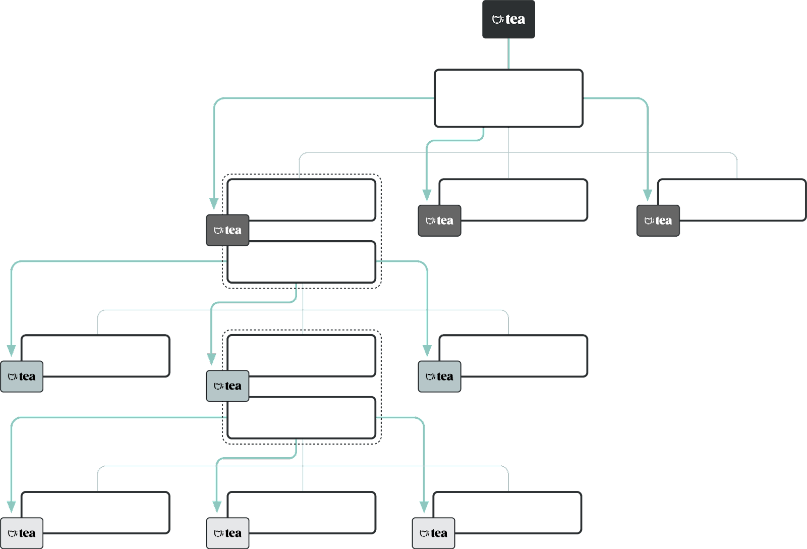

# papel blanco

## Un protocolo descentralizado para que los desarrolladores de código abierto capturen el valor que crean

* Max Howell
* Thomas Borrel
* Timothy Lewis
* Troy Wong

## Abstract

Un sistema en el que los desarrolladores de código abierto pudieran recibir recompensas proporcionales a sus contribuciones mejoraría la sostenibilidad y la integridad de la cadena de suministro de software. Un protocolo descentralizado garantizado por la reputación y los incentivos podría lograr esto al facilitar la acumulación de valor para los desarrolladores que mantienen bases de código de código abierto como una utilidad pública, promoviendo así la innovación y el crecimiento futuros dentro del ecosistema de código abierto. Los mantenedores de paquetes registrarán sus proyectos en un registro impulsado por una cadena de bloques bizantina tolerante a fallas. El algoritmo exclusivo de "Prueba de contribución" del Protocolo del té determinará la contribución y el impacto de cada proyecto en la utilidad y la salud del sistema. Los proyectos registrados recibirán recompensas del Protocolo del té proporcionales a su contribución, se asegurarán mediante apuestas, se beneficiarán de un sistema de reputación que abarca proyectos y contribuyentes, y tendrán la opción de permitir que las comunidades gobiernen sus regiones del ecosistema de código abierto, independientemente de agendas externas. El Protocolo del té incentivará el mantenimiento del código abierto al permitir que los participantes de la red que registraron sus proyectos y cumplan con las reglas de la red reciban recompensas y contribuyan a su reputación y a sus proyectos. Si se encuentran problemas de seguridad o desarrollo, los desarrolladores pueden hacer afirmaciones respaldadas por pruebas contra el paquete, y es posible que se produzcan recortes. Los miembros de la comunidad de código abierto pueden revisar los paquetes en busca de problemas de calidad, y el protocolo puede responder a estas revisiones implementando eventos de reducción proporcional.

## Descargo de responsabilidad

La información contenida en este documento técnico es de carácter preliminar. En consecuencia, ni los autores ni ninguno de sus respectivos afiliados asumen ninguna responsabilidad de que la información contenida en este documento sea definitiva o correcta y cada uno de los anteriores renuncia, en la máxima medida permitida por la ley aplicable, a cualquier responsabilidad, ya sea que surja por agravio, contrato o de otro modo con respecto a este documento técnico. Ni este documento técnico ni nada de lo contenido en este documento constituirá la base ni será invocado en relación con ningún incentivo para celebrar ningún contrato o compromiso, ni actuará como incentivo para ello.

Nada en este documento técnico constituye una oferta de venta o una solicitud de compra de los tokens aquí analizados. En cualquier caso, si este documento técnico se considerara como una oferta o solicitud de este tipo, este documento técnico no pretende ni transmite dicha oferta o solicitud en ninguna jurisdicción donde sea ilegal hacerlo, donde dicha oferta o solicitud requiera una licencia o registro, o cuando dicha oferta o solicitud esté sujeta a restricciones. En particular, los tokens analizados en este documento no han sido, y, a la fecha de emisión de este documento técnico, no están destinados a serlo, registrados bajo las leyes de valores o similares de ninguna jurisdicción, ya sea que dicha jurisdicción considere que dichos tokens son válidos o no. ser un valor o instrumento similar y no puede ofrecerse ni venderse en ninguna jurisdicción donde hacerlo constituiría una violación de las leyes pertinentes de dicha jurisdicción. No compre ningún token a menos que esté dispuesto a perder el precio total de compra. Es una compra de alto riesgo y es poco probable que esté protegido si algo sale mal.

## Licencia

Este documento está disponible bajo la [licencia internacional Creative Commons Atribución-CompartirIgual 4.0](https://creativecommons.org/licenses/by-sa/4.0/).

## Introducción

La Internet moderna se compone predominantemente de proyectos de código abierto y así ha sido desde sus inicios. Los proyectos de código abierto se desarrollan y mantienen mediante la colaboración entre comunidades de desarrolladores globales, y sus bases de código están disponibles para que cualquiera pueda utilizarlas como un bien público. En los últimos 80 años (se [generalmente se cree](https://archive.org/details/historyofmodernc00ceru)(que el primer ejemplo de software libre y de código abierto se publicó en 1953), el software de código abierto ha evolucionado desde el producto de aficionados a la tecnología especializada hasta la infraestructura sobre la que se ha construido toda la innovación. A pesar de la importancia del software de código abierto, los desarrolladores que crean y mantienen el código base como una utilidad pública no reciben recompensas fungibles por su inmensa contribución como innovadores y mantenedores.

El software empresarial, que se ha convertido en una industria multimillonaria, se basa en los cimientos del código abierto. Sin embargo, casi no se acumula valor para los individuos que ingratamente mantienen sus fundamentos. Y si bien se han hecho fortunas con ello, el software de código abierto se crea y mantiene principalmente como una utilidad pública sin medios viables para que los desarrolladores capturen el valor que crean.

Creemos que el potencial de la Internet moderna se ha visto atrofiado al depender de un pequeño porcentaje de los ingenieros del mundo para mantener el software de código abierto por pura altruismo. El código abierto es una labor de amor que a menudo se ve obstaculizada por la falta de incentivos significativos para los mantenedores principales. Los desarrolladores de código abierto deben elegir entre un trabajo diario que proporcione salarios dignos o mantener la base misma del software empresarial. La falta de incentivos da como resultado que proyectos realmente valiosos nunca alcancen su potencial, mientras que otros sufren problemas de seguridad debido a la falta de mantenimiento durante todo el ciclo de vida del software. Para desbloquear todo el potencial del código abierto, necesitamos un método universal para evaluar el "valor justo" de los proyectos de código abierto, que permita a los desarrolladores de código abierto capturar el valor que crean al facilitar las entradas de capital a la comunidad de código abierto. todo sin alterar los principios básicos de cómo se desarrolla y utiliza el código abierto.

Las empresas a menudo envuelven modelos de negocios en torno al código abierto, generando ingresos directamente del trabajo de los desarrolladores benevolentes y al mismo tiempo confiando en ellos para corregir errores a medida que ocurren. Las bases de código de fuente abierta ofrecen funcionalidad central plug-and-play para empresas; sin embargo, las vulnerabilidades del software pueden representar un riesgo inmenso para las aplicaciones creadas sobre código abierto. Un gran ejemplo es un incidente reciente que involucró una vulnerabilidad de seguridad crítica en Log4j, un paquete de [Apache Software Foundation].(https://www.apache.org/) que encontró su camino a través de muchos software y servicios comerciales empleados por empresas y gobiernos. En noviembre de 2021, un investigador de seguridad que trabaja para [Alibaba Group Holding Ltd.](https://www.alibabagroup.com/) vulnerabilidad reportada [CVE-2021-44228](https://nvd.nist.gov/vuln/detail/CVE-2021-44228), which received the highest possible base score from the Apache Software Foundation. Amit Yoran, Chief Executive of [Tenable](https://www.tenable.com/) y director fundador del Equipo de preparación para emergencias informáticas de los Estados Unidos (US-CERT), describió esta vulnerabilidad como “[la vulnerabilidad más grande y crítica de la última década](https://www.reuters.com/article/usa-cyber-vulnerability-idCNL1N2SY2PA)”. Se desató el pánico y los pocos voluntarios que mantuvieron este paquete fueron criticados públicamente por el fracaso. Después de abordar la indignación con una humilde súplica de justicia, los sistemas fueron parcheados. Las empresas y los gobiernos finalmente se dieron cuenta de que Log4j, un paquete utilizado por una amplia gama de sistemas críticos durante dos décadas, era mantenido por unos pocos voluntarios no remunerados, los mismos héroes anónimos que entraron en acción a pesar de [el abuso de la industria].(https://twitter.com/yazicivo/status/1469349956880408583) y trabajó incansablemente para abordar la vulnerabilidad.

Lamentablemente, Log4j está lejos de ser el único ejemplo. core-js se descarga 30 millones de veces por semana como base de cada aplicación Node.js, pero apenas cuenta con financiación, lo que podría obligar a su principal responsable a [abandonar el proyecto o incluso cambiar la licencia a código cerrado].(https://www.thestack.technology/core-js-maintainer-denis-pusharev-license-broke-angry/). Recientemente, varios desarrolladores centrales de bitcoin renunciaron, citando, entre otras razones, la falta de compensación financiera por su decisión.

<figure><figcaption>
Figure 1 - Dependency - Source: <a href="https://xkcd.com/2347/">https://xkcd.com/2347/</a>
</figcaption></figure>

Ha habido múltiples intentos de proporcionar estructuras de incentivos, que generalmente involucran sistemas de patrocinio y recompensas. El patrocinio hace posible que los consumidores de código abierto donen a los proyectos que prefieren. Sin embargo, imagine el código abierto como una torre de ladrillos donde las capas inferiores han sido olvidadas hace mucho tiempo, pero que aún son mantenidas por ingenieros dedicados y en las que confían aún más desarrolladores. Normalmente, sólo los proyectos en la cima de la torre son conocidos y reciben patrocinio. Esta selección sesgada lleva a que los ladrillos esenciales que sostienen la torre no atraigan donaciones, mientras que los favoritos reciben más de lo que necesitan. Las recompensas permiten a los consumidores de proyectos proponer pagos para que los desarrolladores creen características específicas, recompensando así solo a los proyectos por hacer cosas que pueden no ser lo mejor para ellos. Y de nuevo, sólo premiar a los favoritos.

En el té, hemos visto demasiados proyectos de código abierto que sufren estos intentos fallidos de apoyar a la comunidad de código abierto y nuestra misión es mejorar la sostenibilidad y la integridad de la cadena de suministro de software al permitir que los desarrolladores de código abierto capturen el valor que crean.

En este artículo, proponemos el té, un sistema descentralizado para

1. calcular y asignar una "[Prueba de contribución](white-paper.md#prueba de contribución)" a cada proyecto de código abierto en relación con todo el ecosistema,
2. garantizar que los proyectos de software de código abierto estén bien mantenidos,
3. empoderar a los desarrolladores de código abierto con recompensas equitativas y proporcionales a sus contribuciones en todo el ecosistema, logradas mediante la implementación del algoritmo de incentivos del té en cada entrada del registro de té, y
4. incentivar a los participantes de la red a seguir prácticas de divulgación responsable de vulnerabilidades y errores.

## Componentes

Un desarrollador de software que crea una aplicación necesita cuatro cosas: un navegador, una terminal, un editor y un administrador de paquetes. De estos cuatro, el administrador de paquetes es el que controla las herramientas y los marcos que un desarrollador necesita para construir su producto. En esta capa es donde vemos el potencial de cambiar la forma en que se protege y recompensa el código abierto.

### The Package Manager

The package manager knows what open-source software a package or application depends upon to function, from the top of the tower to its base. Each project, along with every packaged version, meticulously documents all essential components and their corresponding versions.

It knows that the top of the tower carefully selects its dependencies, and that careful selection continues down. The package manager is uniquely placed in the developer tool stack to enable automated and precise value distribution based on actual real-world contribution.

We propose an immutable decentralized registry designed to distribute value based on the tea Protocol’s unique “Proof of Contribution”, an algorithm that determines each project’s contribution and impact to the system’s utility and health. Value can enter the graph at apex points—such as essential libraries—and be distributed to the dependencies of those packages and their dependencies recursively since the registry knows the entire open-source graph.

Additionally, we believe that the information provided by the protocol’s Proof of Contribution must be available for developers to assess whether they can trust a project and its author. This information may be based on reputation, community kudos, data retrieved from decentralized identity ("[DID](https://www.w3.org/TR/did-core/)") systems, other package managers, or incentive mechanisms that potentially rely on network participants putting value at risk.

We predict that tea’s combination of tools, information, and rewards will justly incentivize developers, helping secure the software supply chain, stimulating the growth of open-source software, and fostering innovation.

### The Decentralized Registry

Every package manager has its own package registry duplicating the same metadata repeatedly. In some cases, this registry may include [information that differs from the project’s manifest](https://www.bleepingcomputer.com/news/security/npm-ecosystem-at-risk-from-manifest-confusion-attacks/), thus allowing bad actors to potentially inject nefarious code unbeknownst to the user. It’s time there was a single, comprehensive, and definitive registry designed and governed by the communities that depend on it. This decentralized, immutable registry could provide security, stability and prevent malevolent intent.

The Internet runs on tens of thousands of vital open-source components. It’s remarkable that thus far, incidents caused by the removal of essential open-source infrastructure have been minimal. The most famous was the [removal of an NPM left-pad dependency](https://www.theregister.com/2016/03/23/npm\_left\_pad\_chaos/) in 2016, which cascaded into continuous integration and continuous deployment systems, leaving developers high and dry for days. This event demonstrated that the Internet itself is based on fragile systems of development. Other examples involved active or intentional participation from the package maintainers sabotaging their popular packages (See [colors.js and faker.js](https://fossa.com/blog/npm-packages-colors-faker-corrupted/), as well as [node-ipc](https://www.lunasec.io/docs/blog/node-ipc-protestware/)), or bad actors looking to profit by pretending to help maintain packages and corrupting them to steal, for example, Bitcoin private keys (See [event-stream](https://github.com/dominictarr/event-stream/issues/116)), or malicious packages with intentional misspelling errors, also known as “[typosquatting](https://en.wikipedia.org/wiki/Typosquatting)”, in the hope of tricking users into installing them, for example [crossenv vs. cross-env NPM packages](https://blog.npmjs.org/post/163723642530/crossenv-malware-on-the-npm-registry.html).

Software integrity needs to be guaranteed as the industry progresses towards a future where digital assets are part of the software. We cannot continue to leave ourselves vulnerable to malicious actors modifying the software.

Most tools that we call package managers cannot guarantee that these packages built into the apps and dApps are the unaltered open-source code published by their original authors. [Microsoft’s GitHub has found that 17% of vulnerabilities in software were planted for malicious purposes](https://www.zdnet.com/article/open-source-software-how-many-bugs-are-hidden-there-on-purpose/), with some remaining undetected for extended periods (See [Webmin 1.890](https://threatpost.com/backdoor-found-in-utility-for-linux/147581/)).

A global decentralized registry augmented by a reputation system and supported by incentives designed to expose bad actors and reward good ones may provide the guarantees developer communities have been looking for to secure the software supply chain.

### The Storage System

Open-source projects deliver a broad range of functionality, some of which may be restricted or unwanted. Encryption is an excellent example of that. A critical use case for encryption is the support of individuals’ privacy across the globe. Encryption, however, can also be used for nefarious purposes (see [Phantom Secure](https://www.fbi.gov/news/stories/phantom-secure-takedown-031618), dismantled by law enforcement agencies in March 2018) or may be compromised to support law enforcement activities (See [Operation Ironside (AFP), Operation Greenlight (Europol), and Operation Trojan Shield (FBI)](https://www.europol.europa.eu/media-press/newsroom/news/800-criminals-arrested-in-biggest-ever-law-enforcement-operation-against-encrypted-communication) where the FBI operated an “encrypted” communication platform, AN0M, and convinced criminals to use their “encrypted” phones for secure communication).

Encryption’s broad applications have made it a perfect use case for open-source software and a great example that any solution that stores packages must be tamper-proof and censorship-resistant. tea is a decentralized protocol that does not intend to filter or sanction packages based on their functionality. While the tea governance may elect to remove proven malicious packages (see the [governance section](white-paper.md#governance) for more information), it is critical for the tea system to connect with multiple storage systems, including decentralized ones that demonstrate that a package is unaltered and correctly replicated. Package maintainers may choose the storage system best suited for their need to store and distribute their packages securely.

## Protocol Overview

Designing a protocol to reward open-source contributions presents formidable challenges. Open-source software, being universally accessible, is susceptible to misattribution, appropriation, and malicious tampering. However, the open-source community has consistently demonstrated its willingness to highlight good actors and expose bad actors. Historically, the energy spent reviewing and commenting on other developers’ contributions has been strictly voluntary, despite how time-consuming and crucial reporting and defending findings may be.

We intend to create a decentralized protocol secured by reputation and incentives that enhances the sustainability and integrity of the software supply chain by allowing open-source developers to capture the value they create in a trustless manner. We believe adequate rewards for open-source contributions cannot succeed without both a reputation system and the ability for members of the community to communicate their findings and support (or dissent) for a project or the work of a developer. Additionally, we must provide developers with tools to access and contribute to this reputation system. Tools that include simple visual and programmable access to the version and reputation of all dependencies within their projects.

Transparency into the TEA tokens staked by community members to support each project enhances each project's reputation, much like the number of tokens a package maintainer stakes on their own work signals their commitment to it. These combined data points will help inform a reputation system for all community members and facilitate choice. As the [event-stream package hack](https://medium.com/intrinsic-blog/compromised-npm-package-event-stream-d47d08605502) was not conducted through the package itself, but via one of its dependencies, visibility across all layers of dependencies will be vital to building this trustless system. However, considerations such as computation and transaction (“gas”) costs will need to take priority as the system is designed and built.

Our goal is to reward both Web 2.0 and web3 developers. The intricacies and specifics of each stack make it so that tracking installations of packages could easily fall victim to one or more bad actors. That includes “buying” installations to artificially inflate numbers. An even worse scenario would be introducing fundamental changes to the nature of open-source software by creating unnecessary friction with license keys or other deployment tracking mechanisms. To provide the broadest coverage, we believe that rewards must not rely on a simplistic notion of tracking installations, but rather on incentive mechanisms that encourage the submission of quality packages and the reporting of nefarious or high-risk packages. Lastly, many packages rely on common dependencies. For example, [lodash](https://www.npmjs.com/package/lodash) has 176,308 open-source dependents while [chalk](https://www.npmjs.com/package/chalk) has 100,247 dependents or [log4js](https://www.npmjs.com/package/log4js/) has 3,809 dependents. As more packages are created using the same dependencies, how do we ensure that rewards are distributed fairly and equitably? How do we ensure that the most utilized dependencies are rewarded without starving new or emerging packages and developers? How do we ensure that the incentive system does not end up steering developers away from niche languages to centralize them where incentives are better? But also, as developers, how do we identify packages with the most dependents to build alternatives - leaner, more efficient, better-coded versions of these packages?

At tea, we believe that the lack of visibility and incentives has impeded the evolution of open-source software. Supported by the right incentives and rewards, more developers will be in a position to build, improve and augment open-source software for the betterment of the world.

### Proof of Contribution

In this white paper, we propose “Proof of Contribution”, a novel consensus mechanism designed to quantify the impact of all projects across all open-source systems.

Proof of Contribution assigns a dynamic score, referred to as a project’s teaRank, based on each open-source project’s orientation within, and utilization from the broader open-source ecosystem over time.

We believe that this approach benefits foundational software far removed from the application layer (which tends to be the most visible layer to the public and attracts most of the interest) and extends the reward mechanism to ensure that all components of a project—from the top of the tree, all the way to its base—are rewarded for their contribution.

To calculate each project’s score, teaRank builds upon the foundation laid by [Google's PageRank](https://en.wikipedia.org/wiki/PageRank) algorithm. Google’s PageRank is the search product’s defining component and is built on the graph-like structure of web pages. PageRank, at its core, is a probability distribution algorithm that assigns scores to nodes in a graph, representing the likelihood that anything randomly navigating the graph will arrive at a particular node. This algorithm is particularly effective in a graph-like data structure, such as the internet, because it quantifies the impact of each node (or web page) based on the quantity and quality of edges (links) to it. This algorithm was modified over time to better discern the web’s topology and identify fraudulent links between web pages, allowing various attacks to be mitigated.

Because the graph structure of the internet and the tea Protocol’s decentralized registry share remarkable similarities, PageRank initially appeared to be a promising approach for analysis. However, upon further experimentation, it became apparent that PageRank's anti-spam strategies were less effective when applied to open-source.

The key distinction lies in open-source software metadata. Unlike web pages, most open-source package metadata, such as lines of code and commit messages, are user-generated and susceptible to spoofing. Package managers are vulnerable to spam campaigns, wherein malicious actors flood the registry with packages containing phishing links or other harmful content. Package manager registries may also inaccurately reflect the dependencies of specific projects. This issue, known as “[manifest confusion](https://www.bleepingcomputer.com/news/security/npm-ecosystem-at-risk-from-manifest-confusion-attacks/)” may allow bad actors to inject nefarious code or artificially inflate the impact of third-party dependencies, often for nefarious purposes.

The arduous task of identifying and addressing these spam packages typically falls to security firms or altruistic individuals, neither of which offers a scalable solution to combat spam attacks in open-source.

Proof of Contribution is an algorithm specifically designed to address the identification and isolation of spam packages and ensure only impactful projects receive a fair reward. The details of the Proof of Contribution algorithm will be the subject of a dedicated technical paper.

### Network Participants

In this white paper, we distinguish participants through their contributions. Some may contribute code or verify contributed code. Others may support developers and their reputation.

#### Package Maintainers

tea assumes that package creators maintain their work. In this white paper, we’ll refer to them as “package maintainers”.

Package maintainers must make sure their software continues to deliver increasing value as the industry evolves. They are pillars of open-source communities who need to be empowered and rewarded for their ongoing contributions. However, a package maintainer may decide to discontinue their maintenance efforts or realize they cannot operate at a pace that matches the project’s users’ expectations. To ensure continuity, they must have the ability to transfer control of their project to another developer or group of developers, thereby appointing them as maintainers and granting them ownership and control over existing and future rewards associated with the project.

Similarly, a developer may decide to take on the role of package maintainer by forking the existing project and registering a new one which they will maintain moving forward, thus becoming package maintainers. Once registered, projects whose teaRank exceeds a governance defined threshold start receiving rewards from the tea Protocol through the protocol's Proof of Contribution algorithm, in parallel with the legacy forked project. As the open-source community shifts away from the legacy project in favor of its newer iteration, the Proof of Contribution algorithm will gradually decrease the rewards allocated to the legacy project while boosting those assigned to the new forked project.

It is essential to provide developer communities with the right tools to determine which projects are being maintained and their past and present maintainers’ reputation and quality of work. We’ve too often seen open-source work being tampered with and the efforts of many ruined by bad actors. Although the work of these bad actors is largely discovered and remediated, it is often not until significant damage has been incurred through financial or data loss. Take for example the [event-stream npm package](https://medium.com/intrinsic-blog/compromised-npm-package-event-stream-d47d08605502) that was downloaded over 1.5 million times per week and relied upon by over 1,500 packages when a hacker managed to penetrate the open-source project, gain the trust of its original author, and modify event-stream to depend on a malicious package that would exfiltrate bitcoin wallet credentials to a third-party server. Although tools may help detect some of these attacks, they cannot always be relied upon, which creates an entire community dependent upon each other’s diligence and willingness to share their findings.

We propose introducing incentives via the TEA token described in the "[TEA token](white-paper.md#tea-token)" section, to encourage open-source communities to report their findings constructively, so package maintainers can address them before they are exploited.

#### Package Users and tea community members

“Package users” are software developers focused on solving a specific problem. They often look in the open-source community for the tools they need to experiment quickly and iterate at little to no cost, directly benefiting from the work of package maintainers.

With more than 10 million packages accessible across the top 30 package managers, the absence of universal value attribution to open-source projects can transform the selection of secure and efficient packages for development into a high-risk and daunting endeavor. With no discernible means to attribute and measure value, how do package users efficiently select secure packages for their development?

We believe that the tea Protocol’s Proof of Contribution algorithm combined with other incentives can provide package users with the information they need to select the foundation of their own project quickly and thoughtfully.

#### Project Supporters

In Web 2.0 and web3, a subset of package users, often called “sponsors”, has chosen to support package maintainers through donations or other forms of remuneration; however, this has rarely been the case.

These “project supporters” are organizations or open-source project users who use open-source software to build their commercial products, philanthropists looking to support the ecosystem, or entrepreneurs looking to fund teams to develop components of a larger system.

tea proposes to extend the communities of open-source project supporters to the entire tea community, whether organizations, developers, users, or tech enthusiasts. tea’s goal is to implement decentralized incentive mechanisms through unique use cases of the TEA token for any member of the tea community to contribute to the perpetual sustainability and continuous growth of open-source. Project supporters are free to decide which projects or package maintainers they want to support based on their work, beliefs, or any criteria and metric that would influence their decision. Additionally, project supporters are free to decide how they want to support these projects.

Sponsorship can be an effective system to support open-source development; however, these sponsorships do not typically extend to all dependencies. This limitation benefits favorites and gets in the way of innovation and software building. To strive as the foundation of software development, open-source must empower all developers, whether beginners or experts, across all layers in the tower.

To bolster the sustainability and integrity of the software supply chain and enable open-source developers to capture the value they create, tea aims to establish mechanisms where support benefits all aspects of a project. Support from backers will cascade through a project's dependencies, from the top to the base of the tree. This implicitly places trust in the package maintainer's ability to make informed choices about their stack, thus enhancing their reputation.

<figure><figcaption>
Figure 2 - Rewards distribution across dependencies
</figcaption></figure>

#### tea Tasters

As new projects or new versions of existing projects are released, the validity of the work needs to be provably demonstrated. This information is critical for package users to decide if they can trust the package and its maintainers. Within the tea Protocol, this function is provided by the “tea tasters”.

tea tasters, typically, are experienced software developers willing to dedicate some of their time to check the claims associated with a package (functionality, security, [semantic versioning](https://semver.org/), license accuracy, etc.) and stake both their reputation and TEA tokens to demonstrate the outcome of their research and support their reviews. In the tea Protocol, “staking your tea” is the process of locking TEA tokens to support your reviews, potentially earning rewards or facing penalties based on the consensus about the quality of your reviews. tea tasters also have the option to report bugs or vulnerabilities to package managers confidentially. Valid reports result in rewards from the project's treasury, while invalid reports lead to the forfeiture of the tea taster's stake. Lastly, if package maintainers ignore these reported issues, it triggers penalties, or “slashing”, for the project's treasury.

Like project supporters, tea tasters can influence a project and package maintainer’s reputation; however, their impact is more significant given their role in validating a project’s security, functionality, and quality. tea tasters will also need to build their reputation to support their claims. The quality of their work and the TEA tokens they put at risk as they stake their reviews combined with other external data sources will build each tea taster’s reputation, bringing more value to their work. See the "[Package & Package Maintainer Reputation](white-paper.md#package-and-package-maintainer-reputation)" section for more details on the mechanisms used to influence a project and package maintainer’s reputation.

### Project Registration and Proof of Contribution Rewards

The registration of a project release requires multiple transactions to occur atomically. Specifically:

* The package maintainer must register the project with the decentralized registry,
* The tea Protocol must instantiate a project treasury owned, controlled, and configured by the package maintainers according to the rules defined by the package maintainers, and
* The tea Protocol must register the treasury’s unique name with the Ethereum Naming Service, or ENS, thus simplifying all user interactions with the treasury.

Failure of any one of the operations will result in the protocol reverting to its previous state.

Upon successful registration of a project with a teaRank surpassing a governance-defined threshold, the tea Protocol initiates the distribution of Proof of Contribution rewards to the project's treasury. We suggest distributing these rewards following a predetermined curve from a predefined pool of tokens controlled by the tea Protocol and allocated from the TEA tokens total supply.

Package maintainers are required to bolster their project's reputation and trustworthiness by consistently staking a portion of the Proof of Contribution rewards received by the project's treasury. For each token staked, network participants will receive a non-transferrable “staked TEA”, or stTEA, at a 1:1 ratio, to participate in the governance of the tea Protocol. In line with the protocol's rules, these staked rewards, and their corresponding stTEA, may be subject to reduction (“slashing”) or redistribution if package maintainers fail to address bugs or vulnerabilities.

Lastly, failure to maintain the minimum staked treasury ratio defined in the governance rules will result in the suspension of Proof of Contribution reward distribution to the project. Instead, these rewards will be redistributed among compliant projects.

### Package & Package Maintainer Reputation

A reputation system that relies solely on the author’s economic contribution does not provide sufficient user protection and can be subject to Sybil attacks, where a single individual creates multiple representations of themselves to leave a large volume of positive reviews on their work, tricking users into believing their work was reviewed and approved of by many.

Several methodologies are available to prevent Sybil attacks, some of which are described by Nitish Balachandran and Sugata Sanyal in “[A Review of Techniques to Mitigate Sybil Attacks](https://arxiv.org/abs/1207.2617/)”. As tea is a decentralized protocol, using a trust certification system that relies on a centralized certificate issuance authority would be contrary to its core. We propose to focus on decentralized approaches to Sybil attack mitigation and, more specifically, on methodologies that rely on a large group of network participants incentivized to assess and publicly represent the reputation of each package and its maintainer.

Similar to the production of blocks on a proof-of-stake blockchain, where non-producing nodes can validate the work of others and, when necessary, highlight a violation of the rules of the network, leading to a penalization of the bad actor through slashing (destruction of a portion of their stake), we propose a system whereby third-parties, such as tea tasters, would be able to review packages produced by package maintainers and be incentivized to behave in the best interest of the open-source software community and its users, as well as recognize good behavior and penalize bad behavior. This system must be both Sybil-resistant and prevent large token holders from materially influencing the protocol or the reputation of specific packages. We believe this approach to be more aligned with open-source, providing a more fertile substrate to foster adoption and trust, and ultimately facilitate the growth of tea.

Additionally, as the reputation of any member of the tea community reaches key milestones, they may be granted access to elevated parts of the protocol.

### Package Review by Third Parties

The review of packages by third parties is an essential component of reputation building and the security of the software supply chain. However, third-party reviews come with their own set of unique threats including the aforementioned Sybil attacks.

Blockchain technology, and more explicitly staking, offers a unique opportunity for tea to tackle this challenge. Although wallet addresses may be available in infinite quantities, this is not the case with TEA tokens, whose total supply is expected to be 10 billion. Additionally, each action performed by developers, such as submitting, verifying, or staking packages, will contribute to their reputation, thus creating a unique profile each developer can use to both contribute to the tea community and participate in tea’s governance.

By requiring third-party reviewers to stake TEA tokens and incur the risk of losing a portion of their stake should they turn out to behave against the interest of the network or be a bad actor, third parties can provide additional credence to a package and receive a reward, in the form of TEA tokens.

We also propose extending the reputation system to the third parties who perform the independent verification of packages—the tea tasters. The completion of a positive review will require two operations to occur atomically:

* The submission of the code review, signed by the tea taster and publicly accessible to all members of the community, along with
* The act of staking the package, to substantiate their review.

The completion of a negative review that includes one or more critical vulnerabilities will require the tea tasters to first contact the package maintainer using a messaging protocol to notify them of the vulnerability and allow them to address the issue in a timely fashion. Upon expiry of the governance-defined period allocated to the package maintainer to address their vulnerability or as the corrected package becomes available, the same messaging protocol will be used to notify users and testers of this package (including dependents) that a vulnerability has been identified, and hopefully addressed, so they know to update their application or dependencies. To disincentivize wasting developers’ time, communication between the tea tasters and package maintainers will require the tea tasters to stake TEA tokens.

Upon completing both operations, the tea tasters will receive an NFT as evidence of their work on the specific package and package version. The accumulation of NFTs combined with the staking ratio of each of the packages reviewed and information extracted from external systems will inform a tea taster’s reputation. As their reputation reaches key milestones, tea tasters may earn access to elevated parts of the protocol or accelerated rewards from the protocol, as decided by the tea governance.

### Outdated or Corrupt Packages

tea’s mission is to enhance the sustainability and integrity of the software supply chain by allowing open-source developers to capture the value they create; however, rewards must be commensurate with the efforts deployed by package maintainers and tea tasters. Under-maintained, outdated, or corrupted packages are clear indications of package maintainers not living up to the community’s expectations or not delivering on the trust and support impressed upon them through the staking of packages. Another manifestation of outdated packages may be the continued use of a legacy language or legacy version of multi-version languages. Packages remaining outdated or corrupt for too long indicate that tea tasters need to review package maintainers’ work regularly and consistently.

tea tasters play a pivotal role in open-source communities, as their reviews and associated claims can influence package users, either guiding them towards or away from specific packages. To ensure that reviews can be trusted on an ongoing basis, we propose a mechanism whereby reviews posted by tea tasters must be associated with staked TEA tokens. Outdated or corrupted packages may see a portion of their treasury slashed, while another portion is sent to the tea taster who first recognized the lack of maintenance of any package.

As packages gain in popularity and usage, with more applications and potentially mission-critical systems depending on them, we must incentivize developers to discreetly report flaws to the package maintainer and encourage package maintainers to address such flaws before they can be exploited. Consequently, we propose that any negative review which outlines a flaw such as a zero-day vulnerability or the use of an outdated dependency and remains open beyond a grace period defined by governance should be considered a failure on the part of the package maintainer and be subject to the same penalties with the first tea taster to report the flaw receiving a portion of the slashed tokens.

The same can be said for package supporters who staked their reputation and TEA tokens on the work of delinquent package maintainers and received rewards for it. As they failed to identify the lack of maintenance or elected to continue to support the package regardless, we propose that all slashing activities extend to the supporters of the package.

Distribution to all tea tasters could be based on the age of their review and the number of TEA tokens they staked for their review.

## TEA Token

TEA is a cryptographic token which serves as the access key to certain parts and designated features of the tea Protocol.

Holders of TEA token have the ability to:

* Register their packages;
* Support packages by staking TEA tokens to specific packages;
* Contribute to the security of the software supply chain by challenging packages and conducting reviews to report bugs and/or vulnerabilities.

As discussed, the tea Protocol unlocks the open-source economy and creates value for builders, maintainers, and end-users of enterprise software. Ultimately, the value captured by the tea Protocol accrues back to token holders as the community scales, creating a feedback loop that further incentivizes participation.

### Rewarding Open-Source Developers

We expect tea’s Proof of Contribution and staking mechanisms to foster the growth of open-source by empowering its participants with the resources they need to pursue their passion unencumbered.

As outlined in "[Project Registration and Proof of Contribution Rewards](white-paper.md#project-registration-and-proof-of-contribution-rewards)", projects registered with the tea Protocol and with a teaRank that surpasses a governance-defined threshold will receive Proof of Contribution rewards in the form of TEA tokens from the tea Protocol. This distribution will persist as long as the package complies with the rules of the protocol. Specifically, the package will have to maintain a teaRank above the governance defined threshold and package maintainers will have to contribute to their project’s reputation and trustworthiness by continuously staking a portion of the Proof of Contribution rewards received by the project’s treasury. Failure to comply with these rules will result in the suspension of the distribution of Proof of Contribution rewards and the redistribution of future rewards among compliant projects.

Dependencies can significantly affect the reliability and security of a package, and the absence of registration for a package's dependencies should be seen as a potential risk. Package maintainers, being both validators and users of these dependencies, are in a prime position to connect with the maintainers of those dependencies. They can encourage them to register their projects with tea, thus making them subject to oversight by tea tasters and eligible for associated rewards. To encourage this community-wide engagement aimed at enhancing the reputation system, we recommend that any package with dependencies that are not registered with the tea Protocol see a fraction of its Proof of Contribution rewards burnt. This burn would be proportional to the number and contribution, quantified in teaRank, of each unregistered dependency, and continue as long as these dependencies remain unregistered.

Numerous cases have demonstrated that strong incentives can entice malicious actors to compromise open-source software. Most of the Internet’s critical infrastructure is running on open-source, and the race to find exploits and other vulnerabilities is on. At tea, we believe that package maintainers are not the ones that should be blamed (although they often are).

The tea Protocol's incentives address this issue by ensuring a fair and equitable distribution of incentives. A package like lodash with over 176k dependents is a pillar of open-source development, and its maintainers deserve to be rewarded proportionally. However, a reward system built solely on the number of dependents would prevent innovators from disrupting these monopolies unless they are sufficiently funded by third parties or have already accumulated enough resources to self-fund. This approach would likely lead to a shrinking number of contributors, resulting in the polar opposite of what tea is about.

To address this limitation and empower every TEA token holder with the ability to support package maintainers, we also recommend that a governance-defined fraction of all staking rewards received by all network participants be directed towards the treasury of the staked package, along with its dependencies.

### Staking to Secure the Software Supply Chain

Staking can be an effective methodology to support a decentralized reputation system. However, to facilitate the security of the software supply chain, the tea incentive distribution system must carefully consider the staking ratio of each package and adjust each package’s incentive accordingly.

To reduce the risk of a small number of packages used as dependencies across many applications collecting most staking rewards, we recommend the implementation of an optimum staking ratio, similar to the approach described in the [research produced by the web3 Foundation](https://research.web3.foundation/Polkadot/overview/token-economics).

When a package exceeds the governance-defined optimum staking ratio, the total amount of staking rewards allocated to the package will remain fixed, regardless of the number of TEA tokens staked to the package. This measure, designed to de-incentivize package supporters and tea tasters from further staking highly staked packages, will result in a linear decrease of the staking rewards received by each package supporter.

A curve-based approach, such as the one described in the web3 Foundation’s research would slow down the reduction of the staking rewards pool allocated to the package, thus continuing to take away from lesser staked packages and introducing negative externalities by granting more influence on large token holders over the distribution of the staking rewards pool.

The recommended linear design should allow lesser staked packages to become more attractive to both package supporters and tea tasters. It may also incentivize experienced developers to build alternatives to highly-staked packages, creating an opportunity for the tea community to balance supporting existing software and promoting innovation. In its initial design, the staking ratio will be calculated using the circulating supply. The tea community may alter this design to improve the system’s scalability further.

Just as good actors need to be rewarded; bad actors need to be identified and penalized. Open-source software provides many opportunities for bad actors to create pain points and reputational risks for an entire community of developers. From the misappropriation of work to the alteration and redistribution of software packages, or the injection of nefarious code, the war between good and bad actors goes on, often with well-funded bad actors who see the contamination of open-source packages as an opportunity to benefit financially. The downside has been relatively minimal, with packages potentially banned from digital shelves or subjected to a poor reputation.

To directly address malicious actors and intensify the repercussions for actions contrary to the open-source, we recommend implementing the slashing mechanism detailed in the “[Package Review by Third Parties](white-paper.md#package-review-by-third-parties)” and “[Outdated or Corrupt Packages](white-paper.md#outdated-or-corrupt-packages)” sections.

As tea tasters evaluate and analyze the code in newly submitted packages, we suggest tea tasters receive the tools and incentives to pinpoint and highlight nefarious code so

* package users can be made aware of the risks, and
* package maintainers and package supporters are penalized for submitting or supporting nefarious code.

To that extent, for all evidenced negative reviews performed per the network rules and which have been addressed by the package maintainer within the governance defined period, the package maintainer should not incur any penalty contrary to the package supporters or the tea tasters who provided a positive review of the package in question.

For negative reviews performed per the network rules and that the package maintainer has not addressed within the governance-defined period, a fraction of the TEA tokens staked by the project’s treasury, the package supporters, and previous tea tasters will be slashed and sent to the tea taster who identified the bug or vulnerability. Another fraction will be locked into an insurance pool controlled by the tea governance. The tea governance will establish policies and rules in close collaboration with the community to distribute the pool’s contents to those affected by vulnerabilities. The protocol will distribute a third fraction of the slashed TEA tokens across all tea tasters who contributed to the negative review.

Staking and slashing are vital components of the tea Protocol's incentive and penalty system. Package maintainers are required to stake a portion of their project's treasury, ensuring they have a substantial stake at risk in case they neglect to address bugs or vulnerabilities. Package users, supporters, and tea tasters can also stake TEA tokens to contribute to a package or package maintainer's reputation and actively participate in the protocol to uphold the software supply chain's sustainability and integrity.

Governance is closely tied to this active engagement. For each TEA token staked, participants receive non-transferrable "staked TEA" (stTEA) at a 1:1 ratio, enabling them to participate in the governance of the tea Protocol. Staked rewards and their corresponding stTEA tokens may face reduction (slashing) or redistribution if the protocol rules are not followed, reinforcing accountability within the ecosystem.

### TEA Token Supply Distribution

A majority of the TEA tokens created by the protocol are used as incentives to encourage package maintainers, users, and supporters to perform activities that provide value to the decentralized network. The distribution of TEA tokens to various stakeholders within the protocol is dictated by a “distribution schedule.”

Network incentives will be distributed directly by the tea Protocol, in the form of TEA tokens, to four groups of stakeholders:

* Package Maintainers;
* Package Users (which include all members of the tea community);
* Project Supporters; and,
* tea Tasters.

TEA tokens will also be utilized to support packages and secure the software supply chain through staking, including the right to challenge a package by conducting a review and reporting bugs or vulnerabilities, reward the open-source developers of registered projects, and participate in the governance of the tea Protocol.

It’s recommended that a 10 billion maximum token supply be distributed across all members of the tea community as described below:

<figure><figcaption>
Figure 3 - Token distribution of maximum supply
</figcaption></figure>

Roughly 51.4% of the maximum token supply should be allocated to “Ecosystem & Governance”, which includes incentives for open-source projects to onboard and maintain their codebase as well as rewards for contributing to decentralized votes and consensus via the tea DAO. Tokens allocated to “Ecosystem & Governance” should be distributed as Proof of Contribution rewards, staking rewards, and other types of developer-centric incentives.

Roughly 18.6% of the maximum token supply should be allocated to the “Protocol Development” to ensure the sustainability and continued evolution of the tea Protocol. Roughly 12.7% should be earmarked for “Early Supporters & Advisors”. Roughly 11.0% should be earmarked for a Private sale,  3.0% for a public sale, while the remaining 3.2% should be allocated to support marketplace liquidity once a token generation event occurs.

Detailed Tokenomics, including a comprehensive Token Distribution and Emissions schedule will be the subject of a dedicated paper.

## Governance

Governance is critical to the development, sustainability, and adoption of any distributed system.

We propose that the tea Protocol incorporates governance mechanisms that enable active contributors who have staked TEA tokens to propose and vote on non-financial critical parameter changes. The voting process would be weighted by stTEA token ownership and individual reputation.

Protocol parameters could include the priority to support specific package managers or introduce new protocol features or functions, as well as the impact of external factors on user and package reputation. This functionality will ensure that critical parameters can evolve and be optimized over time by active members of the tea community. We anticipate governance will launch with a simple structure and progressively expand as the tea system matures, facilitating adoption and ensuring progressive decentralization.

Some system parameters may not be subject to governance or support high frequency changes to reduce the attack surface represented by governance. A progressive transition of parameters to open, decentralized governance will ensure the stability and predictability of the system.

## Third-Party Extensibility

As we build the initial tools to ignite the long-overdue support of the open-source communities, we believe part of our mission is to ensure that third parties can extend the overall toolset. In addition to providing the infrastructure for developers to build extensions to the protocol, including new ways to innovate and further the support of open-source developers, our plans include the potential for other package managers to contribute to the protocol.

The dreams and efforts of open-source developers have built the innovation that supports our everyday life. We look forward to discovering the new uses and extensions for the tea Protocol proposed by the tea community.

## Future Work and Potential Community Efforts

As the tea system matures, we foresee the community deciding and contributing to alterations and extensions of the tea system through governance. Below are some ideas that we believe may inspire some, however we do not guarantee any future performance.

### tea Wholesalers

Open-source software communities are vibrant and constantly looking to innovate and deliver value. This dedication and altruism lead to the constant building of new software and packages, each one pulling dependencies. As a result, we anticipate the dependencies map to evolve constantly, leading to frequent changes to the staking ratio and rewards. In the future, the tea community may propose the development of a system designed to dynamically monitor the staking ratio for each project and rebalance how project supporters stake their TEA tokens based on their own criteria.

### Royalties on Package Transfer

We recognize that package maintainers may decide to transfer their rewards stream to one or more developers. The governance of such transfer must remain the decision of the package maintainer and their partners, with no interference from tea. Tools will need to be provided for such transfer to be total or partial (perhaps through only a portion of the rewards being redirected to one or more developers, while the remaining rewards continue to flow to the original package maintainer) and for the staking rewards to flow through a single account controlled by a single network participant, multiple network participants, or automatically distributed across multiple accounts using static or dynamic ratios.

### Rewards Distribution Across Multiple Maintainers

The maintenance of a package can rely on the work of one more team of developers. Before rewards start to flow, teams should consider automating the distribution of value amongst themselves. How the distribution occurs must be decided by the maintainers themselves, as they are in the best position to evaluate who contributed and how they should be rewarded.

To accomplish that, each team (or teams) could set up their own decentralized autonomous organization ([DAO](https://ethereum.org/en/dao/)) and either automate the distribution or deploy more complex systems to determine the adequate value distribution based on external factors such as a vote from all DAO members, or time-based distributions based on continuous contribution, successful completion of bounties, etc.

### Handling Package “Forks”

We believe that forks are essential and largely under-utilized. Forks can be an effective tool for developing packages that compete in functionality, performance, security, and even attention. As useful as they may be, forks must recognize the original efforts. Through future work or potential contributions, the tea community may enhance the system to require forks to be declared, perhaps even detected when a project is registered. Undeclared forks revealed by tea tasters may result in a portion of the fork’s treasury’s stake being slashed, transferred to the original package maintainer, or sent to the tea tasters who revealed the fork.

### Runtime vs. Build Dependencies

tea may not distinguish build dependencies from runtime dependencies when distributing Proof of Contribution rewards at launch. However, provided the tea community feels strongly about making such a distinction, the tea community may propose enhancements to the rewards distribution algorithm to account for the criticality of each dependency and their contribution to the individual value of the packages that depend upon them. These proposals would be voted upon and implemented based on the community’s decision.

### Usage-based Rewards

As more applications are built using projects registered with tea, the community may augment the reward algorithm so that allocation may be influenced by external attested datasets such as usage. This update to the rewards mechanism could allow for a higher allocation of TEA token rewards to flow towards packages with the highest usage while still respecting the constraints of the staking ratio described in the TEA token section. Package maintainers could use a similar approach to distribute rewards across their dependencies based on the transparent logic of their choice. Note that all information used to affect the distribution of rewards across packages and dependencies in the tea system will need to be provably reliable.

## Acknowledgments

This white paper would not exist without the support and dedication of many teaophiles. The authors would like to acknowledge Jacob Heider, Jadid Khan, Josh Kruger, and Shane Molidor for their contribution to the tokenomics, Sanchit Ram for his contribution to the teaRank algorithm, and the many discrete individuals who volunteered their time to provide feedback on the contents of this document.

## Glossary of Terms

| Term     | Definition                                                                                                                                                                                        |
| -------- | ------------------------------------------------------------------------------------------------------------------------------------------------------------------------------------------------- |
| Leaf     | The smallest denomination of the TEA token. A leaf corresponds to one quintillionth (10^−18) of a tea.                                                                                            |
| Slashing | The action of penalizing stakers in response to behavior contrary to the protocol rules.                                                                                                          |
| Staking  | The action of locking TEA tokens to support your claim and receive rewards (or penalties) based on the consensus on the validity of your claim.                                                   |
| stTEA    | Non-transferrable “staked TEA” token or “stTEA” received by network participants for each token staked at a 1:1 ratio. stTEA can be utilised to participate in the governance of the tea Protocol |
| teaRank  | Dynamic impact score assigned to each project by the protocol’s “Proof of Contribution” algorithm.                                                                                                |

## References

1. [https://creativecommons.org/licenses/by-sa/4.0/](https://creativecommons.org/licenses/by-sa/4.0/)
2. [https://archive.org/details/historyofmodernc00ceru](https://archive.org/details/historyofmodernc00ceru)
3. [https://nvd.nist.gov/vuln/detail/CVE-2021-44228](https://nvd.nist.gov/vuln/detail/CVE-2021-44228)
4. [https://www.reuters.com/article/usa-cyber-vulnerability-idCNL1N2SY2PA](https://www.reuters.com/article/usa-cyber-vulnerability-idCNL1N2SY2PA)
5. [https://twitter.com/yazicivo/status/1469349956880408583](https://twitter.com/yazicivo/status/1469349956880408583)
6. [https://www.thestack.technology/core-js-maintainer-denis-pusharev-license-broke-angry/](https://www.thestack.technology/core-js-maintainer-denis-pusharev-license-broke-angry/)
7. [https://www.w3.org/TR/did-core/](https://www.w3.org/TR/did-core/)
8. [https://www.bleepingcomputer.com/news/security/npm-ecosystem-at-risk-from-manifest-confusion-attacks/](https://www.bleepingcomputer.com/news/security/npm-ecosystem-at-risk-from-manifest-confusion-attacks/)
9. [https://www.theregister.com/2016/03/23/npm\_left\_pad\_chaos/](https://www.theregister.com/2016/03/23/npm\_left\_pad\_chaos/)
10. [https://fossa.com/blog/npm-packages-colors-faker-corrupted/](https://fossa.com/blog/npm-packages-colors-faker-corrupted/)
11. [https://www.lunasec.io/docs/blog/node-ipc-protestware/](https://www.lunasec.io/docs/blog/node-ipc-protestware/)
12. [https://github.com/dominictarr/event-stream/issues/116](https://github.com/dominictarr/event-stream/issues/116)
13. [https://blog.npmjs.org/post/163723642530/crossenv-malware-on-thenpm-registry.html](https://blog.npmjs.org/post/163723642530/crossenv-malware-on-the-npm-registry.html)
14. [https://www.zdnet.com/article/open-source-software-how-many-bugs-are-hidden-there-on-purpose/](https://www.zdnet.com/article/open-source-software-how-many-bugs-are-hidden-there-on-purpose/)
15. [https://threatpost.com/backdoor-found-in-utility-for-linux/147581/](https://threatpost.com/backdoor-found-in-utility-for-linux/147581/)
16. [https://www.fbi.gov/news/stories/phantom-secure-takedown-031618](https://www.fbi.gov/news/stories/phantom-secure-takedown-031618)
17. [https://www.europol.europa.eu/media-press/newsroom/news/800-criminalsarrested-in-biggest-ever-law-enforcement-operation-against-encryptedcommunication](https://www.europol.europa.eu/media-press/newsroom/news/800-criminals-arrested-in-biggest-ever-law-enforcement-operation-against-encrypted-communication)
18. [https://medium.com/intrinsic-blog/compromised-npm-package-event-stream-d47d08605502](https://medium.com/intrinsic-blog/compromised-npm-package-event-stream-d47d08605502)
19. [https://www.npmjs.com/package/lodash](https://www.npmjs.com/package/lodash)
20. [https://www.npmjs.com/package/chalk](https://www.npmjs.com/package/chalk)
21. [https://www.npmjs.com/package/log4js/](https://www.npmjs.com/package/log4js/)
22. [https://www.bleepingcomputer.com/news/security/npm-ecosystem-at-risk-from-manifest-confusion-attacks/](https://www.bleepingcomputer.com/news/security/npm-ecosystem-at-risk-from-manifest-confusion-attacks/)
23. [https://medium.com/intrinsic-blog/compromised-npm-package-eventstream-d47d08605502](https://medium.com/intrinsic-blog/compromised-npm-package-event-stream-d47d08605502)
24. [https://semver.org/](https://semver.org/)
25. [https://arxiv.org/abs/1207.2617](https://arxiv.org/abs/1207.2617)
26. [https://research.web3.foundation/Polkadot/overview/token-economics](https://research.web3.foundation/Polkadot/overview/token-economics)
